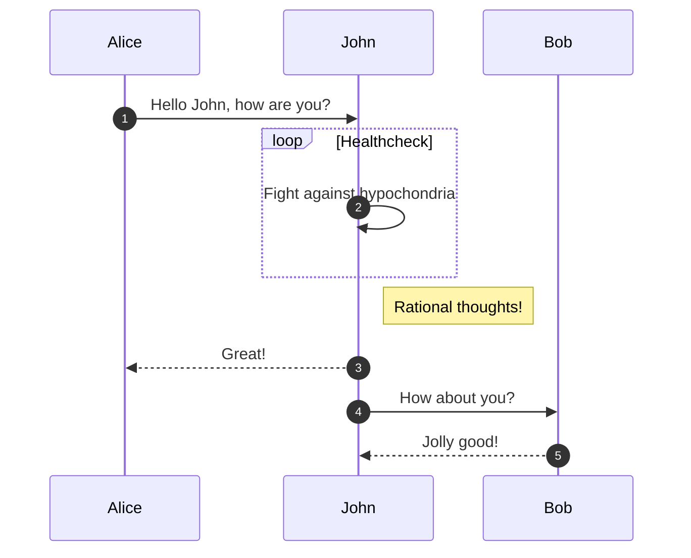
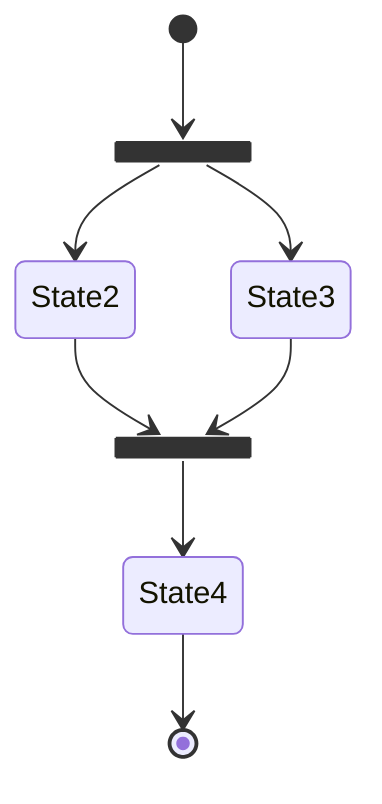

# 日本語のテスト
## h2タグ
### h3タグ
#### h4タグ
[Aboutページへ](https://ktokmshr.github.io/ktok-pages/about/){ .md-button .md-button--primary }


## 適当に
!!! note
    色々と試してみる

??? note
    閉じることもできる

!!! Warning
    waringでwaring  
    色々と種類があるのでdocs見ておく  
    リンク→[リンク](https://squidfunk.github.io/mkdocs-material/reference/admonitions/#inline-end)←リンク


## リスト
- ジム行く
- 食事見直し
    - 普通にリスト

## オーダーリスト
1. あいうえお
    1. a i u e o
    2. アイウエオ
2. かきくけこ
    1. ka ki ku ke ko
    2. カキクケコ
        1. ｋａｋｉｋｕｋｅｋｏ
        1. ああああああああああああああああああああああああ


## TODOリスト
- [x] 終わったやつ
    - [ ] 子タスクが終わってないのに終わるわけがない
    - [x] 終わった


## 画像


## Mermaid
### シーケンス


### フローチャート


## コード
``` python
import pandas as pd
import numpy as np

a = 1
b = 2
print(f"a + b = {a+b}")
```
